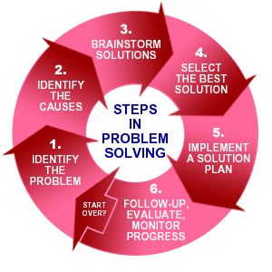
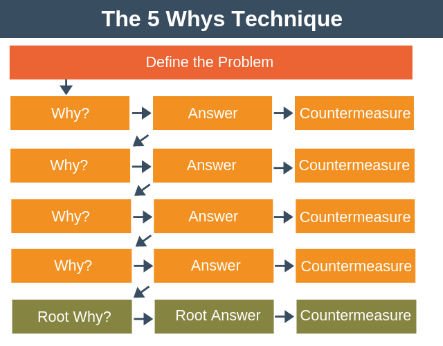

# How to Solve Programming Problems?

1. Read the problem completely twice.
2. Solve the problem manually with 3 sets of sample data.
3. Optimize the manual steps.
4. Write the manual steps as comments or pseudo-code.
5. Replace the comments or pseudo-code with real code.
6. Optimize the real code.

# Act like you make $1000/hr

* If you don’t treat yourself and your time with respect, you will become unhappy, resentful, and tired. Your body and mind long for mastery and freedom; you can’t have those things if your time is cheap and easily taken.

* *As you think, so you are.*
* Treat your time as a valuable commodity, and people will begin to treat it like that, too.
* *“The difference between successful people and really successful people is that really successful people say no to almost everything.”* -Warren Buffet

# How to think like a programmer

### Unless you have a system, this is probably how you “solve” problems

Try a solution.

* If that doesn’t work, try another one.
* If that doesn’t work, repeat step 2 until you luck out.
* Look, sometimes you luck out. But that is the worst way to solve problems! And it’s a huge, huge waste of time.

The best way involves

1. having a framework
2. practicing it.

# How to Use the 5 Whys

 
The core idea of the 5 Whys system is exactly what it sounds like: ask the question “Why?” five times to understand the root cause of an issue. It was developed by Taiichi Ohno, the father of the Toyota Production System.  “Observe the production floor without preconceptions,” he advised his staff. “Ask ‘why’ five times about every matter.”
Ready to try it? The 5 Whys method follows a very simple five-step process.

1. Assemble your team.

    First, invite people who are familiar with the issue and the process you are trying to fix to the 5 Whys meeting.

2. Select a facilitator for your meeting.

    The facilitator will lead the discussion, ask the 5 Whys, and keep the team focused on the issue at-hand.

3. Define the problem.

    Discuss the problem with your team, and then focus on creating a clear and concise problem statement. To get started, answer the questions, What is going on, when did it happen, where did it happen, and who found the problem.

    Write your problem statement on a whiteboard, leaving enough room to answer the 5 Whys below.

4. Ask why five times.

    The first why should cover why the problem is happening. The method will work best if your answer is grounded in fact. No guessing allowed. Avoid going down the path of deductive reasoning, which can muddy the process. Answer each question quickly to avoid going down rabbit holes and jumping to conclusions.

5. Know When to Stop

    Continue asking why until you feel that you’ve examined each path and can go no further. If your first why generated more than one reason, you can now go back and repeat the process until you’ve explored those routes, as well.

    Note: As you go through this process, you may find that someone dropped the ball along the way. Instead of placing blame, the goal is to ask, Why did the process fail? This line of questioning will show what organizational processes need to be fixed.

6. Address the root causes.

    By now, you should have identified one true root cause. With the group, discuss what countermeasures can be taken to prevent the issue from happening again. The facilitator may assign responsibilities for these countermeasures to the group.

7. Monitor your countermeasures.

    The process doesn’t end there. It’s important to monitor how effectively your measures solved or minimized the problem. If nothing has changed, you may have identified the wrong root cause and need to repeat the process.
