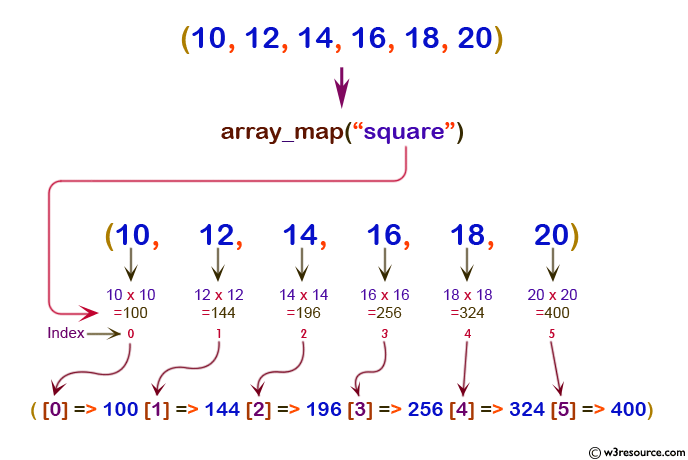
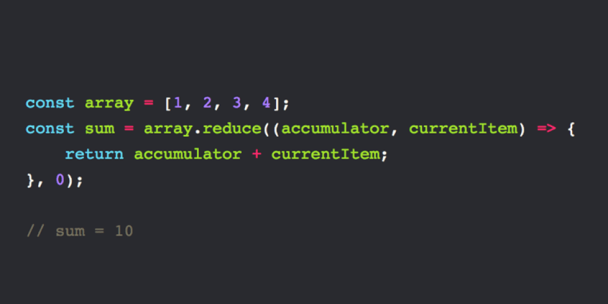
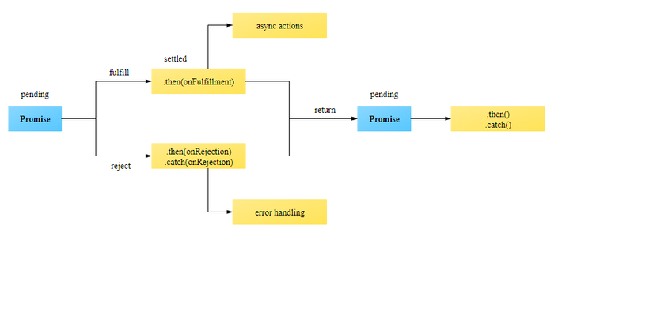

# Node Ecosystem, TDD, CI/CD

## Review, Research, and Discussion

## 1. what Array.map()  does?

 ##  it is a method used to iterate over an array and calling function on every element of array,
 ## to create a new array from an existing one.

   ###  (It loops through each item in the original array, transforms it in some way, and then pushes it into a new array).

   

 ## 2. what Array.reduce() does?
 ### Reduce is a method that takes an array and reduces it to a single value.(or fold or accumulate).
  


## 3. Provide code snippets showing how to use superagent() to fetch data from a URL and log the result
### With normal Promise .then() syntax
```
superagent.get('https://swapi.dev/api/species/')
.then((data)=>{ 
let mainData=data.body;
let array=mainData.results.map(item=>new NewObj(item));
console.log(array);
}).catch(error=>console.log(error));
```

### Again with async / await syntax
```
let cityName =async(name)=>{
  await superagent.get(`https://geocode.xyz/${name}?json=1`)
  .then(result=>{
    let data= result.body;
    console.log (data.latt);
    console.log (data.longt);
  });
}
```

## 4. Explain promises as though you were mentoring a Code 301 level student.

### Once a promise has been called, it will start in a pending state.
### This means that the calling function continues executing, while the promise is pending until it resolves, ### giving the calling function whatever data was being requested.
### The created promise will eventually end in a resolved state, or in a rejected state, calling the respective callback functions (passed to then and catch) upon finishing.




## 5. Are all callback functions considered to be Asynchronous? Why or Why Not?

### callbacks don't have anything to do with the async concept at all.
### They're just regular functions, and they don't know or care whether they're going to be called asynchronously or not.
