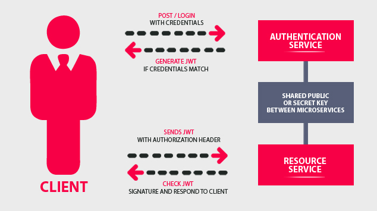

# Bearer Authorization

## Review, Research, and Discussion

* Write the following steps in the correct order : 
  * Register your application to get a client_id and client_secret 
  * Ask the client if they want to sign in via a third party 
  * Make a request to a third-party API endpoint 
  * Make a request to the access token endpoint 
  * Receive access token
  * Redirect to a third party authentication endpoint 
  * Receive authorization code 

* What can you do with an authorization code?
  * to authentic a user or to authorize a user get certain information.

* What can you do with an access token? to give secure authorization.
* What’s a benefit of using OAuth instead of your own basic authentication? it is stronger.

## Vocabulary Terms

### Client ID :

* The id read-only property of the Client interface returns the universally unique identifier of the Client object. 
  
### Client Secret:

* must be kept secret or anyone could potently use your application credentials.
  
### Authentication Endpoint :

* used to verify the identity of a network's external or remote connecting device.
  
### Access Token Endpoint :

* a key that allows you to enter protected resources.

### API Endpoint :

* an endpoint is one end of a communication channel. When an API interacts with another system, the touchpoints of this communication are considered endpoints. 

### Authorization Code :

* An authorization code is an alphanumeric password that authorizes its user to purchase, sell or transfer items, or to enter information into a security-protected space.
  
### Access Token:

* Access tokens are used in token-based authentication to allow an application to access an API.

## JWT

* **JSON Web Token (JWT)** is an open standard (RFC 7519) that defines a compact and self-contained way for securely transmitting information between parties as a JSON object. This information can be verified and trusted because it is digitally signed.

### When should you use JSON Web Tokens?

* **Authorization**: This is the most common scenario for using JWT. Once the user is logged in, each subsequent request will include the JWT, allowing the user to access routes, services, and resources that are permitted with that token. Single Sign On is a feature that widely uses JWT nowadays, because of its small overhead and its ability to be easily used across different domains.

* **Information Exchange**: JSON Web Tokens are a good way of securely transmitting information between parties. Because JWTs can be signed—for example, using public/private key pairs—you can be sure the senders are who they say they are. Additionally, as the signature is calculated using the header and the payload, you can also verify that the content hasn't been tampered with.

### What is the JSON Web Token structure?

* JSON Web Tokens consist of three parts separated by dots `(.)`, which are:
  * Header
  * Payload
  * Signature 

