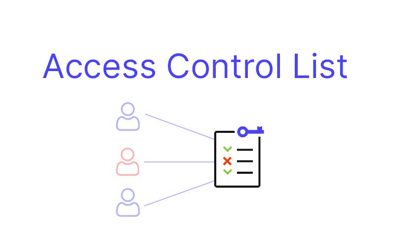
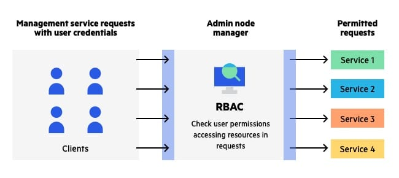

# Access Control (ACL)

### 1. When is Basic Authorization used vs. Bearer Authorization?

 * The Basic authentication schemes are dedicated to the authentication using a username and a secret.

 * The Bearer authentication scheme is dedicated to the authentication using a token even if this scheme comes from an OAuth2 specification, you can still use it in any other context where tokens are exchange between a client and a server.
  
### 2. What does the JSON Web Token package do?

* A JSON Web Token is used to send information that can be verified and trusted by means of a digital signature. It comprises a compact and URL-safe JSON object, which is cryptographically signed to verify its authenticity, and which can also be encrypted if the payload contains sensitive information

### 3. What considerations should we make when creating and storing a SECRET?

* Use encryption to store secrets within .git repository (keep it protected by saving it in .env file)
* Use environment variables
* Use “Secrets as a service” solutions
* Never store decrypted secrets in .git repositories
* Avoid git add * commands on git
* Add sensitive files in .gitignore
* Don’t rely on code reviews to discover secrets
* Use automated secrets scanning on repositories

****

## Vocabulary Terms

|      Word      |     Definition       |
| :------------: | :----------------------------------: |
|   Encryption   |is the method by which information is converted into secret code that hides the information's true meaning. |
|     Token      | used in bearer authentication, a token is a cryptic string that is generated by the server in response to a login request|
|     bearer     | is dedicated to the authentication using a token. Even if this scheme comes from an OAuth2 specification, you can still use it in any other context where tokens are exchange between a client and a server |
|     Secret     | is what is paired with a token, a secret string stored on the server used to sign and encode the token.                                                   |
| JSON Web Token | is an Internet proposed standard for creating data with optional signature and/or optional encryption whose payload holds JSON that asserts some number of claims.                      |

****
****

# RBAC

# **What is RBAC?**

* **RBAC** is an approach to restricting system access to authorized users. It is used by the majority of enterprises with more than 500 employees,

* **Benefits of RBAC:**

   1. Access control lists (ACL)
   2. Attribute-based access control (ABAC)

## RBAC implementation

1. Inventory your systems
2. Analyze your workforce and create roles
3. Assign people to roles
4. Never make one-off changes
5. Audit

## Three primary rules are defined for RBAC

1. Role assignment: A subject can exercise a permission only if the subject has selected or been assigned a role.
1. Role authorization: A subject's active role must be authorized for the subject. With rule 1 above, this rule ensures that users can take on only roles for which they are authorized.
1. Permission authorization: A subject can exercise a permission only if the permission is authorized for the subject's active role. With rules 1 and 2, this rule ensures that users can exercise only permissions for which they are authorized.

## When defining an RBAC model, the following conventions are useful:

* S = Subject = A person or automated agent
* R = Role = Job function or title which defines an authority level
* P = Permissions = An approval of a mode of access to a resource
* SE = Session = A mapping involving S, R and/or P
* SA = Subject Assignment
* PA = Permission Assignment
* RH = Partially ordered Role Hierarchy. RH can also be written: ≥ (The notation: x ≥ y means that x inherits the permissions of y.)
  * A subject can have multiple roles.
  * A role can have multiple subjects.
  * A role can have many permissions.
  * A permission can be assigned to many roles.
  * An operation can be assigned to many permissions.
  * A permission can be assigned to many operations.

### **Comparing with ACL**

* **RBAC** differs from access control lists **(ACLs)**, used in traditional discretionary access-control systems, in that RBAC systems assign permissions to specific operations with meaning in the organization, rather than to low-level data objects.
