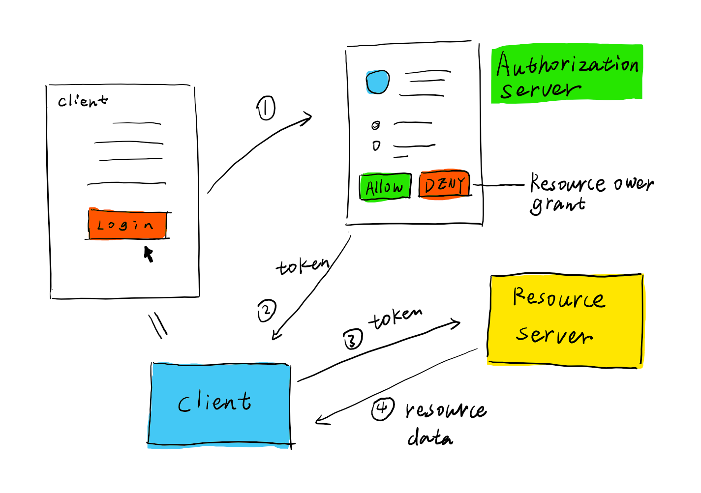
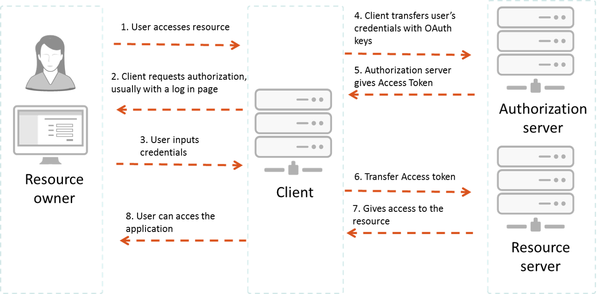

# OAuth
## What is OAuth:

* An open protocol to allow secure authorization in a simple and standard method from web, mobile and desktop applications.
* OAuth doesn't share password data but instead uses authorization tokens to prove an identity between consumers and service providers.

## OAuth Examples

* The simplest example of OAuth in action is one website saying “hey, do you want to log into our website with other website’s login?”

## The most common OAuth 2.0 grant types are listed below.
* Authorization Code
* Implicit
* Password
* Client Credentials
* Device Code
* Refresh Token

## How OAuth Works?

## Advantages  of OAuth 2.0
* is a very flexible protocol .

* OAuth 2.0 relies on SSL which is used to ensure cryptography industry protocols and are being used to keep the data safe.

* It allows limited access to the user's data and allows accessing when authorization tokens expire.

* It has ability to share data for users without having to release personal information.

* It is easier to implement and provides stronger authentication.
