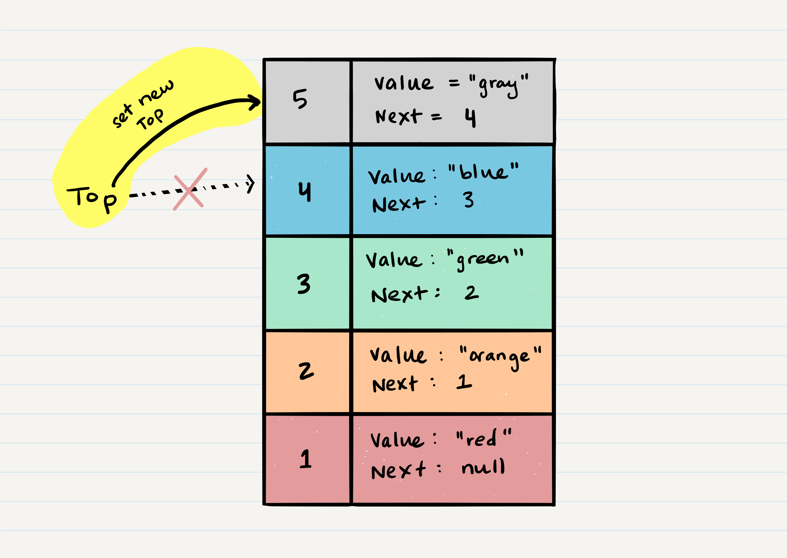
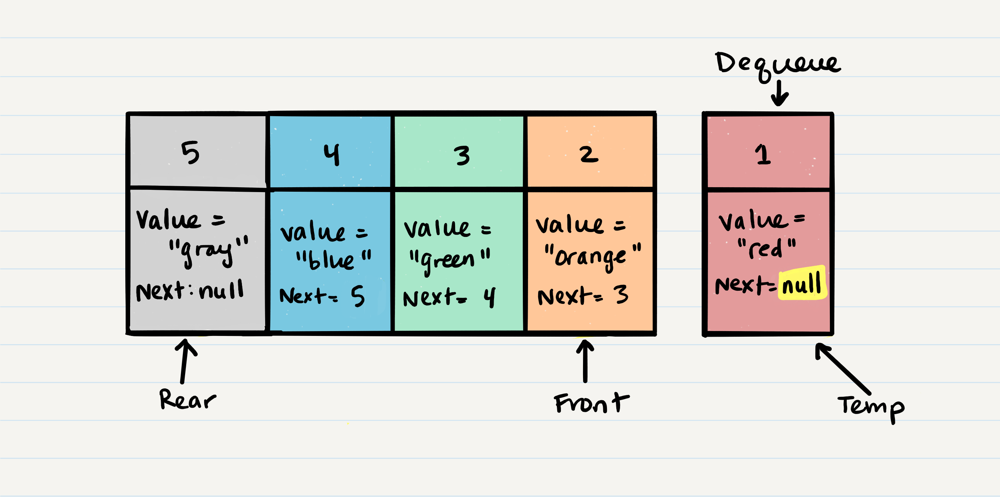

# Stacks and Queues

## What is a Stack
A stack is a data structure that consists of Nodes. Each Node references the next Node in the stack, but does not reference its previous.

 
1- Push - Nodes or items that are put into the stack are pushed
2-Pop - Nodes or items that are removed from the stack are popped. When you attempt to pop an empty stack an exception will be raised.
3-Top - This is the top of the stack.
4-Peek - When you peek you will view the value of the top Node in the stack. When you attempt to peek an empty stack an exception will be raised.
5-IsEmpty - returns true when stack is empty otherwise returns false.

## stack concept

* `FILO `
First In Last Out

This means that the first item added in the stack will be the last item popped out of the stack.

* `LIFO`
Last In First Out 

This means that the last item added to the stack will be the first item popped out of the stack.

## Stack Visualization

**PUSH**

assign the next property of Node 5 to reference the same Node that top is referencing: Node 4

re-assign our reference top to the newly added Node, Node 5.

****

## What is a Queue

Common terminology for a queue is

1-Enqueue - Nodes or items that are added to the queue.
2-Dequeue - Nodes or items that are removed from the queue. If called when the queue is empty an exception will be raised.
3-Front - This is the front/first Node of the queue.
4-Rear - This is the rear/last Node of the queue.
5-Peek - When you peek you will view the value of the front Node in the queue. If called when the queue is 6-empty an exception will be raised.
7-IsEmpty - returns true when queue is empty otherwise returns false.

## Queues follow these concepts:

`FIFO`
First In First Out

This means that the first item in the queue will be the first item out of the queue.

`LILO`
Last In Last Out

This means that the last item in the queue will be the last item out of the queue.

## Enqueue

change the next property of Node 4 to point to the Node we are adding.

re-assign the rear reference to point to Node 5

### Dequeue 

create a temporary reference type named temp and have it point to the same Node that front is pointing too.

re-assign front to the next value that the Node front is referencing

re-assign the next property on the temp Node to null

