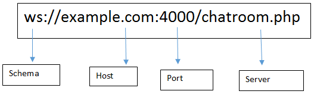

# Socket.io

## what is a WebSocket?

- It is a computer communications protocol, providing full-duplex communication channels over a single TCP connection.

- The Transmission Control Protocol (TCP) is one of the main protocols of the Internet protocol suite. It originated in the initial network implementation in which it complemented the Internet Protocol (IP). Therefore, the entire suite is commonly referred to as TCP/IP. TCP provides reliable, ordered, and error-checked delivery of a stream of octets (bytes) between applications running on hosts communicating via an IP network.

## What is Socket.IO?

-It is a JavaScript library for real-time web applications. It enables real-time, bi-directional communication between web clients and servers. 

## Socket.IO have two parts, mention them?

1. client-side library that runs in the browser.
2. server-side library for node.js.
Both components have an identical API.

## Key features of WebSocket:

1. WebSocket helps in real-time communication between the Client and the webserver.
2. This protocol helps in transforming to cross-platform in a real-time world between the server and the client.
3. This also enables the business worldwide for a real-time web application to enhance and increase the feasibility.
4. The major advantage it stands over an HTTP connection that it provides full-duplex communication.

## WebSocket protocol schema:

## Why do we need WebSocket?

1. It makes real-time communication effortless and efficient.
2. It provides full-duplex communication, which helps in persisting the connection established between the Client and the Web Server.
3. It lives up to the standards and provides the accuracy and efficiency stream events to and from with negligible latency.
4. WebSocket removes the overhead and reduce complexity.

## Review, Research, and Discussion

1. What is the benefit of transforming data into packets?
   - To be able to transfer them individually to reach their destination. Upon reaching their destination, the destination recompiled the data passed thru the packet to adhere to the protocols of whichever TCP/UDP level they are at in the process.
2. UDP is often refereed to as a connectionless  protocol. Why is this?
   - Because No connection needs to be established between the source and destination before you transmit data.
3. Can a socket server application have multiple socket connections?
   - while the server socket can listen to a single port, it is able to share the same server-side IP/PORT pair as long as they are associated with difference client-side IP/PORT pairs.
4. Can a socket connection application be connected to multiple socket servers?
   - No.
5. Can an application be both a socket server and a socket connection?
   - Yes,the application can be both a socket server, and a socket connections.

## Document the following Vocabulary Terms
| Term                     | Definition                                                                                                                                                                                                                                 |
| ------------------------ | ------------------------------------------------------------------------------------------------------------------------------------------------------------------------------------------------------------------------------------------ |
| Observer Pattern         | is a software design pattern in which an object, named the subject, maintains a list of its dependents, called observers, and notifies them automatically of any state changes, usually by calling one of their methods                    |
| Listener                 | is a procedure in JS that waits for an event to occur                                                                                                                                                                                      |
| Event Handler            | a function that runs when a specific event occurs.                                                                                                                                                                                         |
| Event Driven Programming | is when a program is designed to respond to user engagement in various forms.                                                                                                                                                              |
| Event Loop               | is a programming construct or design pattern that waits for and dispatches events or messages in a program. The event loop works by making a request to some internal or external "event provider", then calls the relevant event handler. |
| Event Queue              | is a repository where events from an application are held prior to being processed by a receiving program or system                                                                                                                        |
| Call Stack               | is a stack data structure that stores information about the active subroutines of a computer program.                                                                                                                                      |
| Emit/Raise/Trigger       | in event-driven programming, emit sends a message to trigger a response and raise an event                                                                                                                                                 |
| Subscribe                | subscribe dom events in browser or node.js events.                                                                                                                                                                                         |
| database                 | is a data structure that stores organized information

