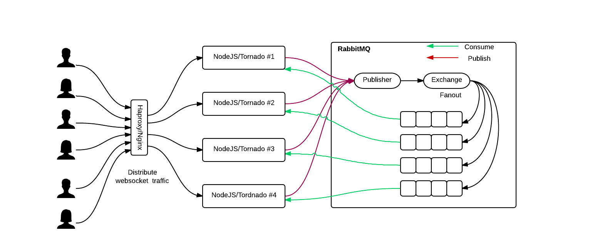
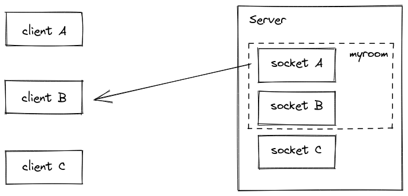

#  Message Queues

## Review, Research, and Discussion

1. What does it mean that web sockets are bidirectional? Why is this useful?

   - to meet the demands of pervasive data-centric applications and services.
2. Does socket.io use HTTP? Why?
   - yes, even when websockets can be used, the initial connection setup it done over HTTP. 
Also, a socket.io server will attach to an HTTP server so it can serve its own client code through /socket.io/socket.io.js.
3. What happens when a client emits an event?
   - The event will be sent to the server, which will be listening for the event if already connected.
4. What happens when a server emits an event?
   - it will send the data.
5. What happens if a client “misses” an event?
   - For the event, it will not excute the handler function for it.
6. How can we mitigate this?
   - Using message queueing. 

***

## Vocabulary Terms
|            |                                                                                                                                                                                                             |
| ---------- | -------------------------------------------------------------------------------------------------------------------------------------------------------------------------------------------------------------- |
|  Web Socket     |     is a computer communications protocol, providing full-duplex communication channels over a single TCP connection                                                                                                                |
|  Socket |  is one endpoint of a two-way communication link between two programs running on the network                                                                                                 |
| Socket.io  | is a JavaScript library for realtime web applications. It enables realtime, bi-directional communication between web clients and servers.                                                                      |
| Client     | program separate from the server that initiates requests for services or info from the server                                                                                                                  |
| Server     | provides function, info, or service back to the client, acts as the main hub for communication                                                                                                                 |
| OSI Model  | is a conceptual framework used to describe the functions of a networking system                                                                                                                                |
| TCP Model  | is the conceptual model and set of communications protocols used in the Internet and similar computer networks.                                                                                                |
| TCP        | is a standard that defines how to establish and maintain a network conversation through which application programs can exchange data                                                                           |
| UDP        | is a communications protocol that is primarily used for establishing low-latency and loss-tolerating connections between applications on the internet.                                                         |
| Packets    | is a small amount of data sent over a network, such as a LAN or the Internet. Similar to a real-life package, each packet includes a source and destination as well as the content (or data) being transferred |

 ****
## Preparation Materials
###  Rooms and Namespaces 

####  What is Room? 

* A room is an arbitrary channel that sockets can join and leave. It can be used to broadcast events to a subset of clients.
* rooms are a **server-only** concept.(i.e. the client does not have access to the list of rooms it has joined)
* Each Socket in Socket.IO is identified by a random, unguessable, unique identifier `Socket#id`.
* We can call join to subscribe the socket to a given channel.
* use to or in (they are the same) when broadcasting or emitting.
* You can emit to several rooms at the same time.

####  What are Namespaces? 

* Socket.IO allows you to Namespace your sockets, which essentially means assigning different endpoints or paths.
* This is a useful feature to minimize the number of resources (TCP connections) and at the same time separate concerns within your application by introducing separation between 
communication channels. 
* Multiple namespaces actually share the same WebSockets connection thus saving us socket ports on the server.
* Namespaces are created on the server side. But they are joined by clients by sending a request to the server.

