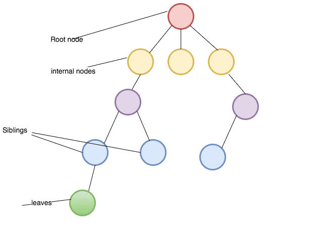
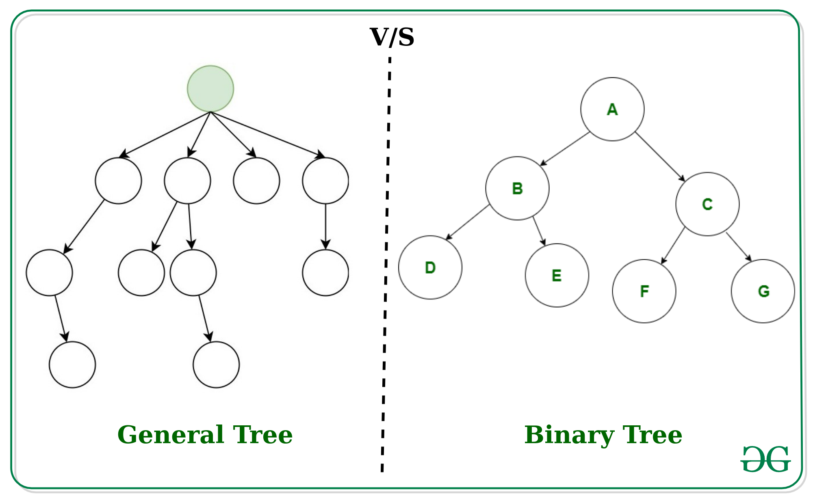

# Trees
 
 ### A Tree node is a component which may contain it’s own values, and references to other nodes

An important aspect of trees is how to traverse them. Traversing a tree allows us to search for a node, print out the contents of a tree, and much more! There are two categories of traversals when it comes to trees:


* Root : The root is the node at the beginning of the tree.

* K : A number that specifies the maximum number of children any node may have in a k-ary tree. In a binary tree, k = 2.

* Left : A reference to one child node, in a binary tree.

* Right : A reference to the other child node, in a binary tree.
* Edge : The edge in a tree is the link between a parent and child node.

* Leaf : A leaf is a node that does not have any children.

* Height : The height of a tree is the number of edges from the root to the furthest leaf.



## Traversals
1. Depth First: 
* Depth first traversal is where we prioritize going through the depth (height) of the tree first.
* Depth first traversal is where we prioritize going through the depth (height) of the tree first. There are multiple ways to carry out depth first traversal, and each method changes the order in which we search/print the root.

```
- Pre-order: root >> left >> right
- In-order: left >> root >> right
- Post-order: left >> right >> root
``` 
* Pre-order means that the root has to be looked at first. In our case, looking at the root just means that we output its value. When we call preOrder for the first time, the root will be added to the call stack

2. Breadth First: 
* Breadth first traversal iterates through the tree by going through each level of the tree node-by-node.
 
* Traditionally, breadth first traversal uses a queue (instead of the call stack via recursion) to traverse the width/breadth of the tree.


 

## Binary Tree Vs K-ary Trees
Trees can have any number of children per node, but Binary Trees restrict the number of children to two (hence our left and right children).


 

### Adding a node
During the traversal, we find the first node that does not have all it’s children filled, and insert the new node as a child. We fill the child slots from left to right.

##### Binary Search Trees


A Binary Search Tree (BST) is a type of tree that does have some structure attached to it. In a BST, nodes are organized in a manner where all values that are smaller than the root are placed to the left, and all values that are larger than the root are placed to the right.
***
### Searching a BST

Searching a BST can be done quickly, because all you do is compare the node you are searching for against the root of the tree or sub-tree. If the value is smaller, you only traverse the left side. If the value is larger, you only traverse the right side.

***